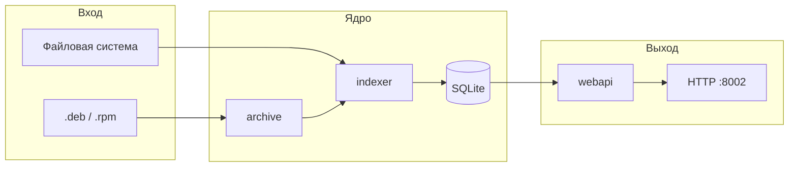

# Разработка debuginfod-go

Руководство для разработчиков: архитектура, локальный запуск, тесты и соглашения.

## Архитектура

### Поток данных



### Модули

| Путь | Ответственность |
|------|-----------------|
| `cmd/debuginfod/main.go` | Загрузка конфига, запуск HTTP и фонового indexer, graceful shutdown |
| `internal/config` | `godotenv` + флаги; приоритет CLI > env > `.env` |
| `pkg/buildid` | Парсинг `SHT_NOTE`: GNU (`NT_GNU_BUILD_ID`) и Go (`NT_GO_BUILD_ID`) |
| `internal/archive` | Извлечение ELF из Debian ar+tar и RPM cpio |
| `internal/indexer` | `filepath.WalkDir`, классификация executable/debuginfo, DWARF sources |
| `internal/storage` | CRUD артефактов, sources, metadata search |
| `internal/webapi` | Маршруты `/buildid`, `/metadata`, `/healthz` |

### Схема SQLite

**`artifacts`** — исполняемые файлы и debuginfo:

| Колонка | Описание |
|---------|----------|
| `build_id` | Канонический hex (GNU или SHA-256 для Go) |
| `type` | `executable` / `debuginfo` |
| `file_path` | Путь на диске для отдачи (оригинал или кэш) |
| `archive_path` | Путь к `.deb`/`.rpm`, если файл из архива |
| `member_path` | Путь внутри архива |
| `build_id_kind` | `gnu` / `go` |
| `raw_build_id` | Оригинальная строка Go build-id |

**`sources`** — исходники, привязанные к build-id через DWARF.

## Go build-id

Go компилятор записывает заметку `.note.go.buildid` (owner `Go`, type `4`). Строка вида `action/module/sum` содержит `/` и **не подходит** для URL.

Канонический ID для HTTP:

```text
build_id = hex(sha256(raw_go_build_id))
```

В metadata дополнительно отдаётся `raw_buildid` для поиска. GNU build-id по-прежнему имеет приоритет, если присутствует оба типа заметок.

## Локальная разработка

### Сборка

```bash
make build          # бинарник ./debuginfod
go build -o debuginfod ./cmd/debuginfod
```

Требуется CGO (`CGO_ENABLED=1`) из-за `go-sqlite3`.

### Запуск с отладкой

```bash
cp .env.example .env
# DEBUGINFOD_SCAN_PATH=/tmp/debugtest
# DEBUGINFOD_RESCAN_INTERVAL=5m

make run-env
```

Минимальный тестовый набор:

```bash
mkdir -p /tmp/debugtest
echo 'int main(){return 0;}' > /tmp/debugtest/main.c
gcc -g -o /tmp/debugtest/hello /tmp/debugtest/main.c

./debuginfod -s /tmp/debugtest -p 8002 -r 24h
```

### Makefile

| Цель | Действие |
|------|----------|
| `make test` | `go test -v ./...` |
| `make vet` | *(добавьте при необходимости)* `go vet ./...` |
| `make fmt` | `go fmt ./...` |
| `make lint` | `golangci-lint run` (нужен установленный линтер) |
| `make clean` | Удалить бинарник и `*.sqlite` |

## Тестирование

```bash
go test ./... -v
go test ./... -race -count=1
```

### Что покрыто тестами

- `pkg/buildid` — парсинг notes, Go/GCC бинарники
- `internal/storage` — CRUD, metadata glob/buildid
- `internal/webapi` — HTTP handlers
- `internal/indexer` — scan ELF и Go binary
- `internal/archive` — RPM (skip без `rpmbuild`)
- `internal/config` — env helpers

### Интеграционные тесты

Пока нет полного e2e «поднять сервер → curl». См. [TODO.md](./TODO.md).

## CI

Workflow: `.github/workflows/ci.yml`

- Триггер: push/PR в `main` и `cursor/**`
- Ubuntu, Go 1.21, `gcc`, `libsqlite3-dev`, `rpm`
- Шаги: `go vet`, `go test -race`, `go build`

## Добавление фичи

1. Завести пункт в [TODO.md](./TODO.md) или issue на GitHub.
2. Написать тесты (предпочтительно до кода).
3. Реализовать с минимальным diff, следуя `.cursor/rules.md`.
4. Обновить README / DEVELOPMENT при изменении API или конфига.
5. `make test && go vet ./...` перед PR.

## Профилирование

```bash
go test -bench=. -benchmem ./pkg/buildid/...
go test -cpuprofile=cpu.out ./internal/indexer/...
go tool pprof -http=:8080 cpu.out
```

## Docker

```bash
docker build -t debuginfod-go .
docker compose up
```

Multi-stage образ: Alpine + CGO build в `golang:1.21-alpine`.

## Cursor / MCP

Правила проекта для AI-ассистента: [`.cursor/rules.md`](./.cursor/rules.md)  
MCP-конфиг: [`.cursor/mcp.json`](./.cursor/mcp.json)

Рекомендуемые MCP в среде разработки:

- **sqlite** — инспекция `debuginfod.sqlite`
- **go** (go-mcp-official) — навигация по Go-коду
- **terminal** — запуск `make test`, `curl` healthcheck

## Ссылки

- [elfutils debuginfod](https://sourceware.org/elfutils/Debuginfod.html)
- [debuginfod(8) man page](https://manpages.debian.org/debuginfod/debuginfod.8)
- [debuginfod-find(1)](https://manpages.debian.org/debuginfod/debuginfod-find.1)
