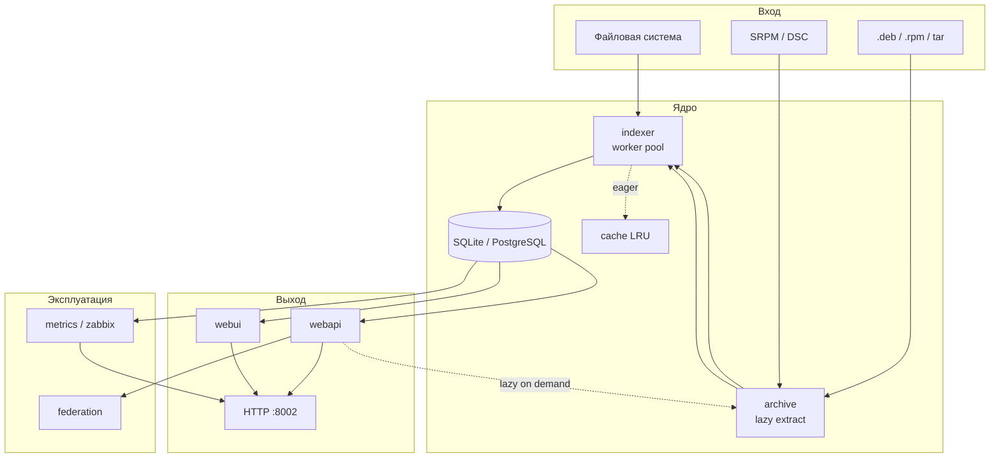

# Разработка debuginfod-go

Руководство для разработчиков: архитектура, локальный запуск, тесты и соглашения.

## Целевые ОС

Сервис развёртывается **только** на:

- **Astra Linux** — `.deb`, `.dsc`, `/usr/lib/debug`
- **Ubuntu** — `.deb`, `.dsc`, `/usr/lib/debug`
- **RedOS** — `.rpm`, `.src.rpm`, `/usr/lib/debug`
- **CentOS** — `.rpm`, `.src.rpm`, `/usr/lib/debug`

Форматы Alpine (`.apk`) и Arch (`.pacman`, `.pkg.tar.*`) **не поддерживаются** в коде.

## Архитектура

### Поток данных



### Модули

| Путь | Ответственность |
|------|-----------------|
| `cmd/debuginfod/main.go` | Конфиг, HTTP-сервер, фоновый indexer, graceful shutdown |
| `internal/config` | `godotenv` + флаги; приоритет CLI > env > `.env` |
| `pkg/buildid` | Парсинг `SHT_NOTE`: GNU и Go build-id; `FromBytes` для lazy |
| `pkg/elfsection` | Извлечение сырых ELF-секций |
| `internal/archive` | ELF и исходники из deb/rpm/tar/SRPM/DSC |
| `internal/indexer` | `WalkDir`, worker pool, инкрементальный scan, DWARF sources |
| `internal/storage` | CRUD артефактов, sources, metadata search, `Stats()` |
| `internal/webapi` | `/buildid`, `/metadata`, `/healthz`, `/zabbix`, gzip, federation |
| `internal/webui` | `/ui/` дашборд, `/ui/api/stats`, `/ui/api/search` |
| `internal/metrics` | HTTP/scan/federation counters → Zabbix JSON |
| `internal/federation` | Проксирование upstream при 404 |
| `internal/cache` | LRU prune `DEBUGINFOD_CACHE_DIR` |
| `internal/logging` | `slog` JSON, уровень из конфига |
| `internal/fnmatch` | `FNM_PATHNAME` для metadata glob |

### Схема БД

**`artifacts`** — executable и debuginfo:

| Колонка | Описание |
|---------|----------|
| `build_id` | Канонический hex (GNU или SHA-256 для Go) |
| `type` | `executable` / `debuginfo` |
| `file_path` | Путь на диске (пустой при lazy extract) |
| `archive_path` | Путь к архиву |
| `member_path` | Путь внутри архива |
| `build_id_kind` | `gnu` / `go` |
| `raw_build_id` | Оригинальная строка Go build-id |
| `mtime_ns` | Время индексации |

**`sources`** — исходники из DWARF и SRPM/DSC:

| Колонка | Описание |
|---------|----------|
| `build_id` | Связь с артефактом (может быть пустым для SRPM) |
| `source_path` | Путь из DWARF или внутри пакета |
| `file_path` | Путь на диске (пустой при lazy) |
| `archive_path`, `member_path` | Для исходников из архивов |

**`scanned_files`** — инкрементальная индексация:

| Колонка | Описание |
|---------|----------|
| `path` | Путь к просканированному файлу |
| `mtime_ns`, `size` | Для определения изменений |
| `kind` | `elf` / `archive` / `sourcepkg` |

Backend: SQLite (`DEBUGINFOD_DB_PATH`) или PostgreSQL (`DEBUGINFOD_DATABASE_URL`).

## Реализованные эндпоинты

| Маршрут | Статус |
|---------|--------|
| `/buildid/<id>/debuginfo` | ✅ stream / ServeFile |
| `/buildid/<id>/executable` | ✅ |
| `/buildid/<id>/source/<path>` | ✅ fallback по суффиксу пути |
| `/buildid/<id>/section/<name>` | ✅ debuginfo → executable |
| `/metadata?key=glob\|file\|buildid` | ✅ fnmatch Pathname, timeout |
| `/healthz` | ✅ |
| `/zabbix` | ✅ JSON для Zabbix HTTP agent |
| `/ui/` | ✅ дашборд |
| `/ui/api/stats` | ✅ |
| `/ui/api/search?q=` | ✅ prefix search build-id |

## Сравнение с upstream debuginfod (elfutils)

| Возможность | upstream | debuginfod-go |
|-------------|----------|---------------|
| `/buildid/.../debuginfo` | ✅ | ✅ |
| `/buildid/.../executable` | ✅ | ✅ |
| `/buildid/.../source/...` | ✅ | ✅ |
| `/buildid/.../section/...` | ✅ | ✅ |
| `/metadata` glob/file/buildid | ✅ | ✅ (fnmatch Pathname) |
| `.deb` / `.rpm` | ✅ | ✅ (целевые ОС) |
| plain tar | ✅ | ✅ |
| `.apk`, pacman | ✅ | ❌ (вне целевых ОС) |
| SRPM / DSC sources | ✅ | ✅ (базово) |
| Федерация (`DEBUGINFOD_URLS`) | ✅ | ✅ |
| Web UI | ❌ | ✅ `/ui/` |
| Prometheus metrics | ❌ | ❌ (Zabbix `/zabbix` вместо) |
| IMA / подписи | ✅ (0.192+) | ❌ |
| LDAP / auth | ❌ | ❌ |
| libdwelf backend | ✅ | ❌ (свой indexer) |

## Go build-id

Go записывает `.note.go.buildid` (owner `Go`, type `4`). Строка вида `action/module/sum` содержит `/` и **не подходит** для URL.

Канонический ID:

```text
build_id = hex(sha256(raw_go_build_id))
```

В metadata отдаётся `raw_buildid`. GNU build-id имеет приоритет, если есть оба типа заметок.

Проверка:

```bash
go build -o /tmp/hello .
go tool buildid /tmp/hello          # raw
readelf -n /tmp/hello               # GNU (если external linker)
```

## Локальная разработка

### Сборка

```bash
make build
go build -o debuginfod ./cmd/debuginfod
```

CGO нужен для SQLite (`CGO_ENABLED=1`, `libsqlite3-dev`). С PostgreSQL CGO не обязателен.

### Запуск

```bash
cp .env.example .env
make run-env
```

Минимальный тест:

```bash
mkdir -p /tmp/debugtest
echo 'int main(){return 0;}' > /tmp/debugtest/main.c
gcc -g -o /tmp/debugtest/hello /tmp/debugtest/main.c
./debuginfod -s /tmp/debugtest -p 8002 -r 24h
```

Проверка UI и API:

```bash
curl http://localhost:8002/healthz
curl http://localhost:8002/ui/api/stats
curl 'http://localhost:8002/ui/api/search?q='
```

### Makefile

| Цель | Действие |
|------|----------|
| `make test` | `go test -v ./...` |
| `make vet` | `go vet ./...` |
| `make fmt` | `go fmt ./...` |
| `make lint` | `golangci-lint run` |
| `make build` | Собрать `./debuginfod` |
| `make build-find` | Собрать `./debuginfod-find` |
| `make package` | Собрать `.deb` и `.rpm` (nfpm) |
| `make offline-bundle-deb` | Оффлайн bundle для Debian/Ubuntu/Astra |
| `make offline-bundle-rpm` | Оффлайн bundle для RedOS/CentOS |
| `make run-env` | Запуск с `.env` |
| `make clean` | Бинарник, sqlite, cache |

## Тестирование

```bash
go test ./... -v
go test ./... -race -count=1
```

### Покрытие по пакетам

| Пакет | Что тестируется |
|-------|-----------------|
| `pkg/buildid` | GNU/Go notes, `FromBytes`, `Normalize` |
| `pkg/elfsection` | Извлечение секций |
| `internal/storage` | CRUD, metadata, `SearchBuildIDForUI`, incremental |
| `internal/webapi` | HTTP handlers, CORS/rate limit/auth, OpenAPI |
| `internal/webui` | `/ui/`, stats, search |
| `internal/indexer` | ELF scan, lazy tar archive |
| `internal/archive` | deb/rpm/tar, DSC parser |
| `internal/fnmatch` | Pathname glob |
| `internal/metrics` | Collector counters |
| `internal/cache` | LRU prune |
| `internal/config` | env helpers |

Инструментальные тесты с `gcc`/`rpmbuild` — `t.Skip` при отсутствии.

## API и клиенты

### Metadata pagination

`GET /metadata` принимает `offset` и `limit`. Ответ:

```json
{
  "artifacts": [ ... ],
  "next_offset": 100
}
```

`next_offset` присутствует только если есть следующая страница. Реализация: `internal/storage/sqlite.go` (`SearchMetadataQuery`), handler — `parseMetadataPagination()`.

### Безопасность

Middleware в `internal/webapi/security.go`:

| Компонент | Конфиг | Поведение |
|-----------|--------|-----------|
| CORS | `DEBUGINFOD_CORS_ORIGINS` | `Access-Control-*` для указанных origins (`*` = все) |
| Rate limit | `DEBUGINFOD_RATE_LIMIT` | Token bucket на IP (0 = выкл) |
| Basic Auth | `DEBUGINFOD_BASIC_AUTH_*` | Защита всех маршрутов кроме `/healthz` |
| mTLS | `DEBUGINFOD_TLS_CERT/KEY/CLIENT_CA` | TLS + опциональная проверка клиентских сертификатов |

### OpenAPI

Спецификация: `internal/webapi/openapi.yaml` (embed). Эндпоинт: `GET /openapi.yaml`.

### CLI `debuginfod-find`

`cmd/debuginfod-find` — обёртка над HTTP API:

```bash
make build-find
export DEBUGINFOD_URLS=http://localhost:8002
./debuginfod-find debuginfo <buildid> -o out.debug
./debuginfod-find --key glob --value '/usr/bin/*'
```

### Примеры (`examples/`)

Демо stripped binary + GDB + docker compose:

```bash
cd examples && make demo
```

См. [examples/README.md](./examples/README.md).

## CI

`.github/workflows/ci.yml`: push/PR в `main` и `cursor/**`.

- Ubuntu, Go 1.21, `gcc`, `libsqlite3-dev`, `rpm`
- `go vet`, `go test -race`, `go build`

## Добавление фичи

1. Пункт в [TODO.md](./TODO.md) или GitHub issue.
2. Тесты (предпочтительно до кода).
3. Минимальный diff, [.cursor/rules.md](./.cursor/rules.md).
4. Обновить README / DEVELOPMENT / `.env.example` / TODO.
5. `make test && go vet ./...` перед PR.

## Деплой

- **Пакеты:** [deploy/README.md](./deploy/README.md) — `make package`, nfpm
- **Оффлайн:** [deploy/offline/README.md](./deploy/offline/README.md) — bundle без интернета
- **systemd:** [deploy/debuginfod-go.service](./deploy/debuginfod-go.service)
- **Zabbix:** [deploy/zabbix/README.md](./deploy/zabbix/README.md)
- **Docker:** `docker compose up --build` (только dev/demo)

## Cursor / MCP

- Правила: [`.cursor/rules.md`](./.cursor/rules.md)
- MCP: [`.cursor/mcp.json`](./.cursor/mcp.json)

Рекомендуемые MCP: **sqlite** (инспекция БД), **go-doc**, **test-runner**.

## Ссылки

- [elfutils debuginfod](https://sourceware.org/elfutils/Debuginfod.html)
- [debuginfod(8)](https://manpages.debian.org/debuginfod/debuginfod.8)
- [debuginfod-find(1)](https://manpages.debian.org/debuginfod/debuginfod-find.1)
