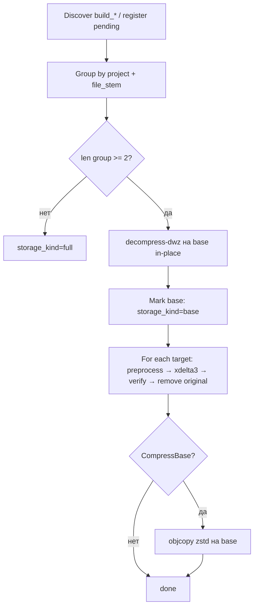

# Сравнение стратегий dedup Quik `.debug`

Документ фиксирует результаты A/B-исследований (июль 2026) и обосновывает выбор production-пайплайна для `internal/dedup`.

**Выборка:** `Released/QuikServer_16.0_Common_Linux`, 72 файла, 9 библиотек × 8 сборок (`build_*`), суммарный объём **583.1 MiB** без dedup.

**Инструменты:** `cmd/bench-dedup`, `scripts/bench-dedup/run-full-matrix.sh`, отчёты `matrix.json|csv|txt`.

**Вне scope всех стратегий:** удаление debug-секций (`.debug_macro`, `.debug_types` и т.п.).

---

## 1. Краткий итог

| Место | Стратегия | Экономия | Stored | Encode | Verify | Статус |
|-------|-----------|----------|--------|--------|--------|--------|
| **1** | **xdelta3 + decompress-dwz + zstd base** | **76.0%** | 139.6 MiB | 32 с | 0 fail | **Production** |
| 2 | bsdiff + decompress-dwz | 68.7% | 182.6 MiB | 417 с | 63 fail | Отклонена |
| 3 | xdelta3 + decompress-dwz | 55.1% | 261.7 MiB | 33 с | 0 fail | Fallback (без zstd base) |
| 4 | zstd whole-file CAS (код до 2026-07) | ~1.8% | ~572 MiB | быстро | OK | Отклонена |
| 5 | xdelta3 без preprocess | 17.2% | 482.4 MiB | 70 с | 0 fail | Минимальный baseline |
| 6 | bsdiff без preprocess | 17.0% | 483.8 MiB | 732 с | 63 fail | Отклонена |
| 7 | dwz на сжатых ELF | 0% | — | — | 9 err | Невозможна |
| — | hdiffpatch | — | — | — | — | Не тестировалась (нет в PATH) |
| — | Strategy C (секционный CAS) | — | — | — | — | Не реализована |

**Интегрировано в production:** `decompress → dwz → xdelta3` с опциональным `objcopy --compress-debug-sections=zstd` на base после создания дельт.

---

## 2. Три исследуемые стратегии (A / B / C)

### Strategy A — «альтернативные диффы + DWARF-оптимизация»

Сравнение алгоритмов диффа и препроцессоров на одной выборке.

| Компонент | Варианты | Результат |
|-----------|----------|-----------|
| Алгоритм | xdelta3, bsdiff, hdiffpatch | **xdelta3** — единственный с 0 verify fail |
| Preprocess | none, dwz, decompress-dwz | **decompress-dwz** обязателен для Quik |
| Post | objcopy zstd на base | +21 п.п. к экономии (55% → 76%) |
| Группировка | stem (default), stem-version, strategy-a | **stem** — 9 групп × 8 файлов |

**Почему dwz «напрямую» не работает:** Quik `.debug` уже содержит `SHF_COMPRESSED` DWARF-секции. `dwz` отказывается:

```text
dwz: Found compressed .debug_aranges section, not attempting dwz compression
```

**Решение:** `objcopy --decompress-debug-sections` → `dwz` → diff.

### Strategy B — «dwz → xdelta3» (фиксированный пайплайн)

Тот же порядок шагов, что и у победителя Strategy A:

```text
objcopy --decompress-debug-sections → dwz → группировка (project + file_stem)
→ xdelta3 (base = min file_build_num) → [опционально] objcopy zstd на base
```

Гипотеза 20–45% **подтверждена с запасом** (55% без zstd base, 76% с zstd base). Strategy B — не отдельная реализация, а описание production-порядка шагов.

### Strategy C — «гибрид diff + секционный CAS»

Идея: межсборочный diff + CAS по ELF-секциям (`.debug_str`, `.debug_info`, …).

| Подход | Оценка |
|--------|--------|
| Секционный zstd/CAS | Не прототипирован; сложность restore и схемы БД |
| zstd `--patch-from` | Не тестировался; ожидается ближе к whole-file CAS |
| dwz -m (multifile) | Build-time; вне server-side scope |

**Вердикт:** отложена. При 76% у Strategy A/B выигрыш неочевиден относительно стоимости реализации.

---

## 3. Отклонённые подходы

### 3.1 zstd + SHA256 CAS (whole-file)

| Метрика | Значение |
|---------|----------|
| Экономия | ~1.8% |
| Причина | Между сборками нет байт-идентичных файлов (`dedup_ref=0`) |
| Статус | Заменён xdelta-пайплайном |

### 3.2 bsdiff

| Метрика | xdelta3 | bsdiff |
|---------|---------|--------|
| Savings (decompress-dwz) | 55.1% | 68.7% |
| Encode | 33 с | 417 с |
| Verify failures | 0 | **63** |
| Вердикт | **Принят** | **Отклонён** (некорректное восстановление) |

Литературное преимущество bsdiff по размеру патча **не компенсирует** массовые ошибки verify на реальных Quik ELF.

### 3.3 xdelta3 без preprocess

- Экономия **17.2%** — в 3× хуже decompress-dwz.
- Пригоден как fallback при отсутствии `dwz`/`objcopy` (env `DEBUGINFOD_DEDUP_STRATEGY=xdelta`).

### 3.4 Группировка strategy-a (commit из `.comment`)

Файлы одного `build_*` часто имеют **один git SHA** в `.comment`; между `build_*` SHA различается → группы распадаются на singletons → дельты не строятся.

**Правильный ключ:** `NormalizeDedupGroupProject(project) + file_stem` (режим `stem`).

Структура `.comment` (типичный Quik файл):

```text
GCC: (AstraLinuxSE 8.3.0-6) 8.3.0
(c) ARQA Technologies, 2000-2026
DBSTUBRC Library
Quik Server
16.0.0.1                                    ← версия продукта (игнорируется)
9ae10425c6bbb99c7ee1f71a3941fd7aee058227   ← git commit SHA
```

---

## 4. Детальная матрица bench-dedup (2026-07-20)

Параметры: 72 файла, `--group-by stem`, 9 групп, base = min `file_build_num`.

| ID сценария | algo | preprocess | zstd base | savings | stored | encode | decode | verify |
|-------------|------|------------|-----------|---------|--------|--------|--------|--------|
| xdelta3_decompress-dwz_objcopy | xdelta3 | decompress-dwz | да | **76.0%** | 139.6 MiB | 32 с | 4.8 с | 0 |
| bsdiff_decompress-dwz | bsdiff | decompress-dwz | нет | 68.7% | 182.6 MiB | 417 с | — | **63** |
| xdelta3_decompress-dwz | xdelta3 | decompress-dwz | нет | 55.1% | 261.7 MiB | 33 с | 4.9 с | 0 |
| xdelta3_none_objcopy | xdelta3 | none | да | 18.4% | 475.9 MiB | 72 с | 1.5 с | 0 |
| xdelta3_none | xdelta3 | none | нет | 17.2% | 482.4 MiB | 70 с | 1.5 с | 0 |
| bsdiff_none | bsdiff | none | нет | 17.0% | 483.8 MiB | 732 с | — | **63** |
| xdelta3_dwz | xdelta3 | dwz | нет | 0% | — | — | — | 9 err |
| bsdiff_dwz | bsdiff | dwz | нет | 0% | — | — | — | 9 err |
| hdiffpatch_* | hdiffpatch | * | — | — | — | — | — | skipped |

Воспроизведение:

```bash
export SCAN_PATH=/path/to/debug_linux
export PROJECT="Released/QuikServer_16.0_Common_Linux"
./scripts/bench-dedup/run-full-matrix.sh
# или
./bench-dedup run-matrix --scan-path "$SCAN_PATH" --project "$PROJECT" \
  --workdir /tmp/bench-matrix --output /tmp/bench-matrix/matrix
```

---

## 5. Production-пайплайн (интеграция)

### 5.1 Порядок шагов ingest



### 5.2 Хранение на диске

| storage_kind | Файл на диске | Примечание |
|--------------|---------------|------------|
| `base` | оригинальный путь, preprocessed (+ optional zstd sections) | GDB читает zstd-секции нативно |
| `delta` | `<original_path>.xdelta` | оригинал удалён |
| `full` | оригинал (singleton) | без дельты |

### 5.3 Restore (HTTP / GDB)

| kind | Действие |
|------|----------|
| `full`, `base` | отдать `file_path` (или кэш) |
| `delta` | при zstd-base: `objcopy --decompress-debug-sections` во временный файл → `xdelta3 -d` → кэш |
| `compressed`/`ref` | legacy zstd CAS: распаковка blob (миграция) |

### 5.4 Конфигурация

```bash
DEBUGINFOD_DEDUP_ENABLED=true
DEBUGINFOD_DEDUP_WORKERS=4
DEBUGINFOD_DEDUP_STRATEGY=xdelta-decompress-dwz   # default
DEBUGINFOD_DEDUP_COMPRESS_BASE=true               # +objcopy zstd на base (76% vs 55%)
DEBUGINFOD_XDELTA_PATH=xdelta3
DEBUGINFOD_DWZ_PATH=dwz
DEBUGINFOD_OBJCOPY_PATH=objcopy
```

Зависимости пакета: `xdelta3`, `dwz`, `binutils` (`objcopy`).

### 5.5 Миграция с zstd CAS / legacy xdelta

При старте `migrateDedupReingest` сбрасывает `storage_kind IN (base, delta, compressed, ref)` → `pending` для повторного ingest.

После обновления: `POST /admin/dedup-backfill?project=...&dry_run=false`.

---

## 6. Рекомендации по эксплуатации

1. **Production:** `xdelta-decompress-dwz` + `COMPRESS_BASE=true` — максимум 76% при проверенном restore.
2. **Упрощённый режим:** `COMPRESS_BASE=false` — 55%, проще restore (base без zstd).
3. **Fallback:** `DEBUGINFOD_DEDUP_STRATEGY=xdelta` — без dwz, ~17%, если нет binutils.
4. **Не использовать:** bsdiff, dwz без предварительной распаковки секций.
5. **Build-time (опционально):** dwz и сжатие секций в CI Quik уменьшат объём до ingest для всех стратегий.

---

## 7. Связанные документы

- [docs/QUIK_DEDUP.md](./QUIK_DEDUP.md) — эксплуатация dedup в debuginfod
- [scripts/bench-dedup/README.md](../scripts/bench-dedup/README.md) — методика бенчмарков
- [scripts/bench-dedup/COMPARISON.md](../scripts/bench-dedup/COMPARISON.md) — краткая сводка матрицы
- [TODO.md](../TODO.md) — roadmap исследований
